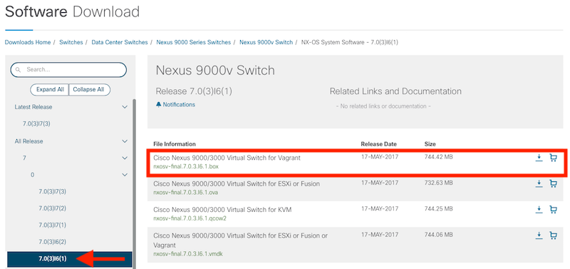

## Optional Step: Downloading Source Artifacts from Cisco

As an example on how to use these resources, for this lab we will build a box for a previous version of Open NX-OS, 7.0(3)I6(1).  If your CCO account has access to other source images (such as for IOS XE with CSR1000v), you can replicate these steps for the other platforms using the information available in the box building repository.  

<!--  -->

1. Navigate to the downloads page for the [Nexus 9000v Switch on Cisco.com](https://software.cisco.com/download/home/286312239/type/282088129/release/7.0%25283%2529I6%25281%2529).  
    * ***Note: If you are completing this lab using the DevNet DevBox Sandbox, you'll need to RDP in and download using a web browser on the workstation.  There is no way to download the image via the CLI.***

1. Change to Release 7.0(3)I6(1) in the view.  

1. Download the **Cisco Nexus 9000/3000 Virtual Switch for Vagrant** `nxosv-final.7.0.3.I6.1.box` file.  You'll need to log into Cisco.com to complete the download.  

#### Next Optional Step: Building the Box
