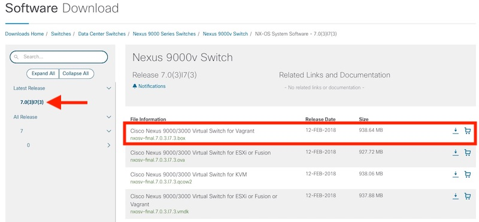

## Step 1: Downloading Nexus 9000v Box from Cisco

For this lab, and following labs in this module, we will use the Nexus 9000v 7.0(3)I7(3) box that is available for download on Cisco.com.  

> The Nexus 9000v downloads are available to download by anyone without any specific contacts with Cisco.

Starting with the 7.0(3)I7(3) release, the NX-OS box images posted to CCO are ready to use without any additional preparation.  Earlier versions of the NX-OS boxes published on CCO require some final preparation to make them ready for use.  If you would like to have boxes for these earlier NX-OS versions, or IOS XE or IOS XR, the remaining **optional steps** in this lab will show you how to do so.  

<!--  -->


1. Navigate to the downloads page for the [Nexus 9000v Switch on Cisco.com](https://software.cisco.com/download/home/286312239/type/282088129/release/7.0%25283%2529I7%25283%2529).  
    * ***Note: If you are completing this lab using the DevNet DevBox Sandbox, you'll need to RDP in and download using a web browser on the workstation.  There is no way to download the image via the CLI.***

1. Make sure you are on Release 7.0(3)I7(3) in the view.  

1. Download the **Cisco Nexus 9000/3000 Virtual Switch for Vagrant** `nxosv-final.7.0.3.I7.3.box` file.  You'll need to log into Cisco.com to complete the download.  

1. Once the download completes, use `vagrant box add` to add the box to your inventory.  Open a terminal prompt and navigate to your downloads directory.  

```bash
Downloads\ $ ls -l *.box
-rw-r--r--@ 1 hapresto  staff   984238080 Apr 28 11:17 nxosv-final.7.0.3.I7.3.box

# Add the box to the inventory.  `--force` will replace a previous box with this name
Downloads\ $ vagrant box add --name nxos/7.0.3.I7.3 nxosv-final.7.0.3.I7.3.box --force

# Expected output
==> box: Box file was not detected as metadata. Adding it directly...
==> box: Adding box 'nxos/7.0.3.I7.3' (v0) for provider:
    box: Unpacking necessary files from: file:///Users/hapresto/Downloads/nxosv-final.7.0.3.I7.3.box
==> box: Successfully added box 'nxos/7.0.3.I7.3' (v0) for 'virtualbox'!
```

1. Verify it was added successfully with `vagrant box list`.  

    ```bash
    Downloads\ $ vagrant box list
    hashicorp/precise64       (virtualbox, 1.1.0)
    nxos/7.0.3.I7.3           (virtualbox, 0)    
    ```

#### Next Optional Step: Obtaining Boxes for Other Platforms (IOS XE, IOS XR, NX-OS)
